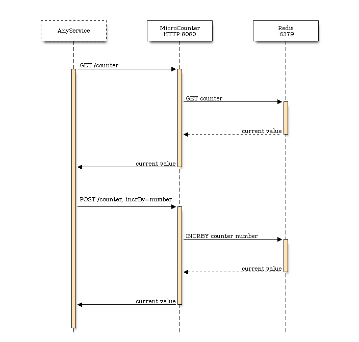

# DevOps Challenge

One of our development teams needs a new HTTP service - `MicroCounter`. It has
to expose an HTTP endpoint to read and increment a counter and may be used
in many different services. It should be a small and independend service.
Perfect task for You - our DevOps. Let's do a PoC using `Redis`!

## MicroCounter service

After discussion we came up with the following interface of our `MicroCounter`:

There are two HTTP endpoints:

* `GET /counter` that returns current value of the counter
* `POST /counter` that increments value of our counter by number given as `incrBy` `POST` parameter
 
## Tests framework

We believe in TDD at Allegro and we can't live without it, even at
infrasctructure level. And for this challenge we made it easier for You ;)
See `test.sh` file. It does 3 things:

* runs `start_env.sh` - script that needs to start all services (including
  `Redis` and `MicroCounter` service) running on `localhost` interface
* runs a series of tests including getting and incrementing value of our counter
* runs `stop_env.sh` - script that needs to cleanup everything done in previous
  steps

# Let's get ready to rumble!

Implement `start_env.sh` that will run on any Linux and MacOSX and will run
`Redis` and `MicroCounter` bound to `localhost` ports `6379` and `8080`.

There is no `MicroCounter` so You need to create it too. It needs to expose two
HTTP methods described above.

Implement `stop_env.sh` that will cleanup everything done in `start_env.sh`.

Submit a pull request with your solution!

You can use any tool that can be found on
[Hacker News](https://news.ycombinator.com/) :)
